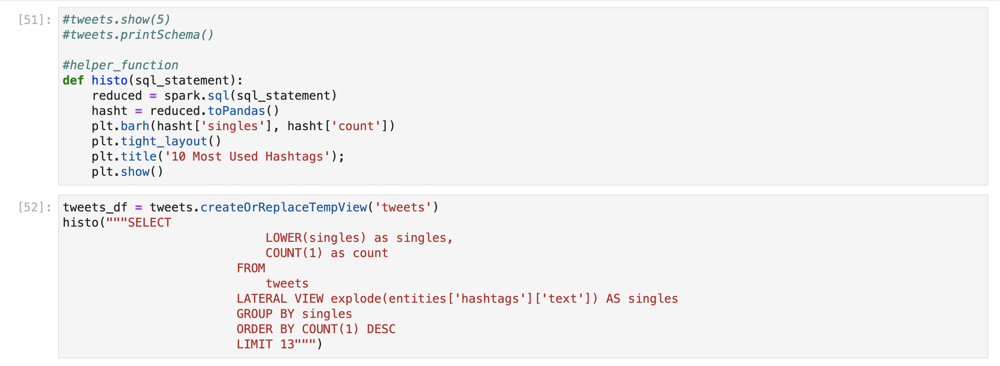
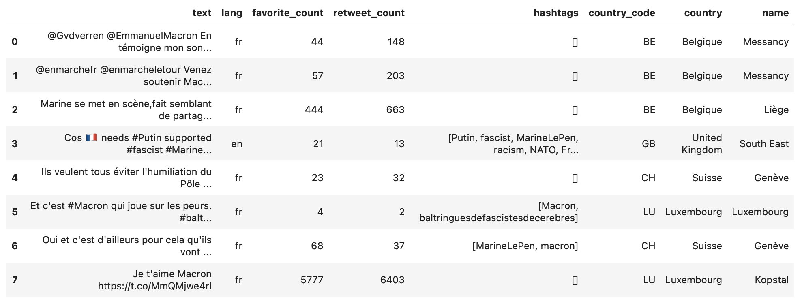
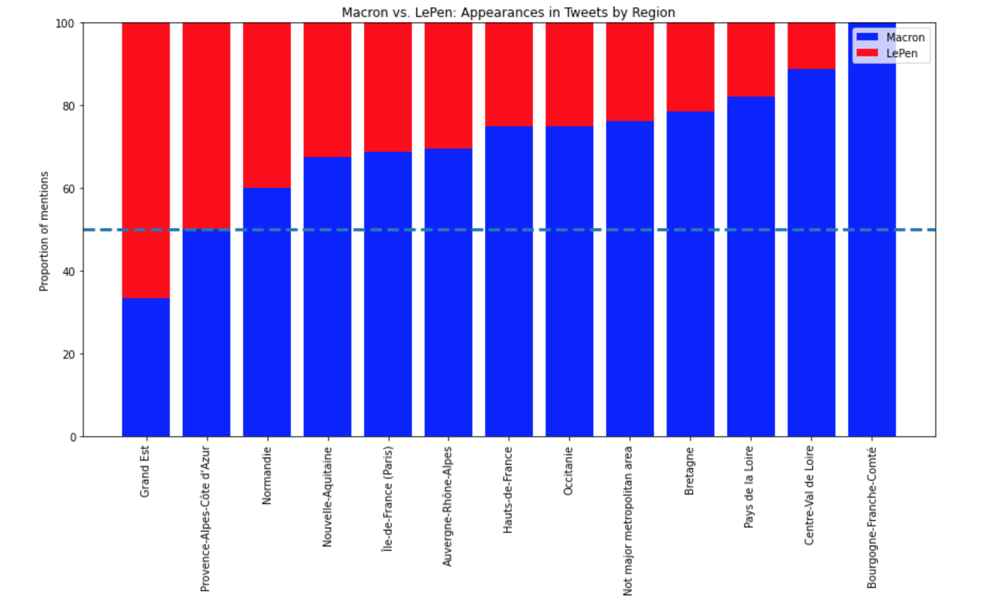
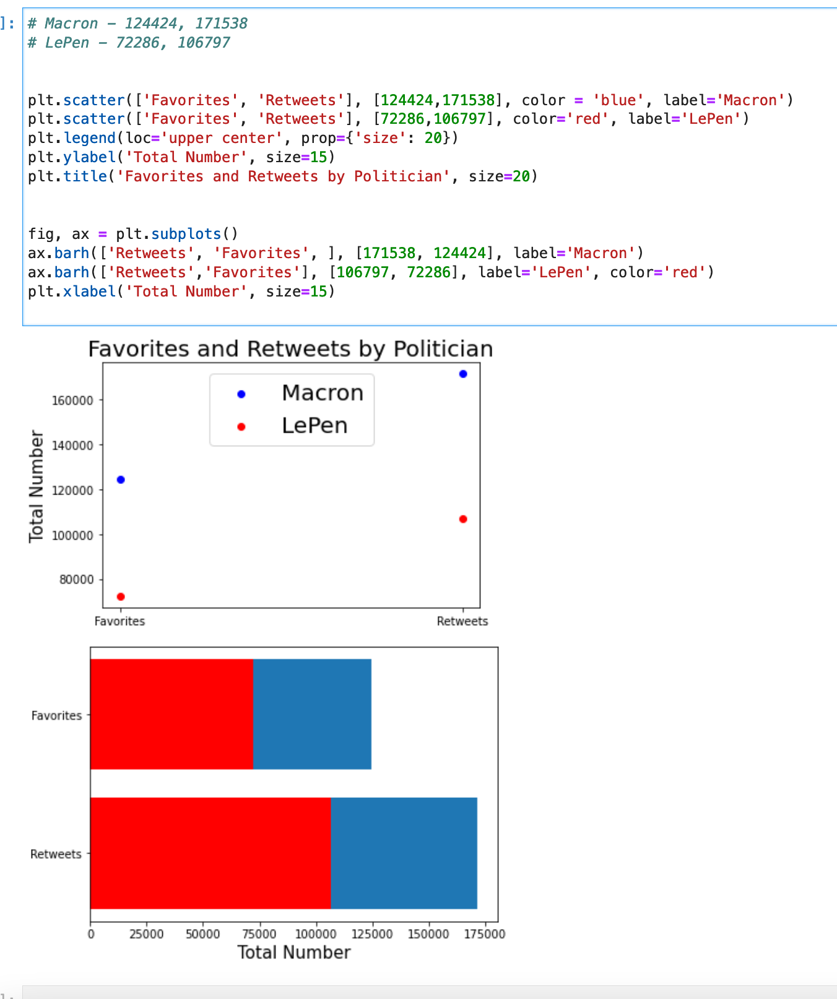

# spark_cs

## Intro

Macron and LePen are harsh rivals in the 2017 France presidential election.

## Goals

* Get top hashtags from dataset

* Filter by city, compare tweets for lepen and tweets for macron

* Group by politician, compare retweet count and favorite count 

* Compare tweets from within to france to tweets outside of the world

## Graphs

